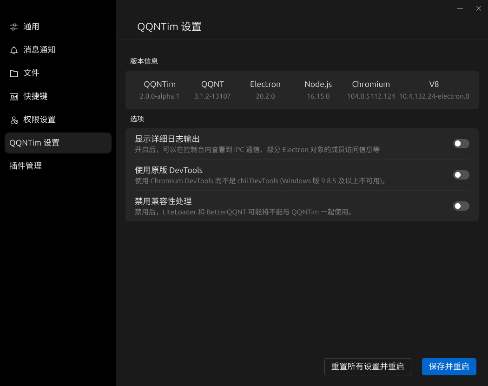

# 使用手册

此文档包含了使用教程。

## 安装

安装前请确保电脑上已经安装了 QQNT。

在 Windows 下，请运行 `install.cmd` 安装 QQNTim，`uninstall.cmd` 卸载。

在 Linux 下，请在安装文件夹下运行：

```bash
# 安装
chmod +x ./install.sh
./install.sh
# 卸载
chmod +x ./uninstall.sh
./uninstall.sh
```

安装后，登录 QQNT，打开设置页面：


出现此界面即代表安装成功：



## 数据文件夹

数据文件夹存放了所有插件和设置。

在 Windows 下，默认数据文件夹位于 `%UserProfile%/.qqntim`（例如：`C:/Users/[你的用户名]/.qqntim`）。

在 Linux 下，默认数据文件夹位于 `$HOME/.local/share/QQNTim`（例如：`/home/[你的用户名]/.local/share/QQNTim`，可能需要启用**显示隐藏文件**选项才能显示出来）。

你可以设置 `QQNTIM_HOME` 环境变量以修改数据文件夹的位置。

一个示例数据文件夹如下图：

```
QQNTim
  ├─ plugins
  ├─ plugins-user
  └─ config.json
```

## 安装插件

如果要安装插件，请将插件**解压**，得到一个文件夹。

文件夹结构如下图所示（每个插件结构各不相同，这里提供的结构图仅供参考）：

```
我的插件 (文件夹)
  ├─ qqntim.json
  ├─ renderer.js
  ├─ style.css
  └─ ...
```

将此文件夹移动到**[数据文件夹](#数据文件夹)下的 [`plugins`](./DEVELOPMENT.md#plugins-文件夹) 或 [`plugins-user/[QQ 号]`](./DEVELOPMENT.md#plugins-user-文件夹) 文件夹**下，此时，文件夹结构如下图所示：

```
plugins 或 plugins-user/[QQ 号]
  ├─ 我的插件 (文件夹)
  │  ├─ qqntim.json
  │  ├─ renderer.js
  │  ├─ style.css
  │  └─ ...
  └─ ...
```

此时，退出并重启 QQNT，插件即可使用。
