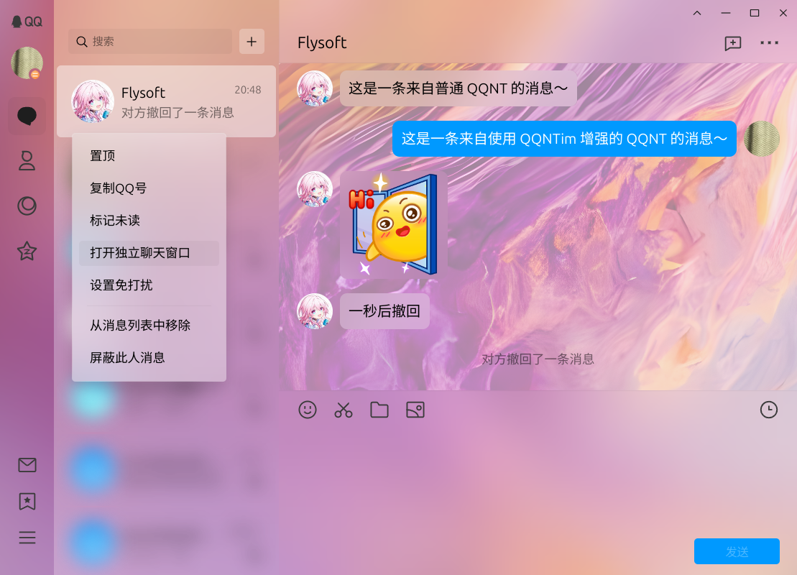

# QQNT-Improved - PC 端 QQNT 插件管理器

[](https://codeclimate.com/github/Flysoft-Studio/QQNTim/maintainability) [](https://github.com/FlysoftBeta/QQNTim/blob/dev/COPYING.LESSER) [](https://github.com/FlysoftBeta/QQNTim/actions/workflows/build.yml)



**注意:** 我们注意到 QQNT (Windows) 最近在进行大幅度修改。为了防止我们的前功尽弃，我们将适当减小更新频率。

QQNT-Improved (简称 QQNTim) 是一个给 QQNT 的插件管理器，目前处于 Alpha 版本阶段，支持 Windows，Linux 等平台 (macOS 未测试，不保证可用性)。

本程序**不提供任何担保**（包括但不限于使用导致的系统故障、封号等）。

## 简介

QQNTim 是一个用于管理插件的程序，其功能需要通过[安装插件](#插件)实现。

## 安装和卸载

### Windows

安装前请确保电脑上已经安装了 QQNT (Windows 版需要有内测资格)。
请右键使用 PowerShell 运行 `install.ps1` 安装插件管理器，`uninstall.ps1` 卸载插件管理器。

**注意:** 如果遇到脚本无法打开的情况，请在运行 (Win+R) 中输入以下内容并点击“确定”以允许 PowerShell 运行脚本：

```powershell
powershell -Command Set-ExecutionPolicy -Scope CurrentUser RemoteSigned -Force
```

### Linux

安装前请确保电脑上已经安装了 QQNT。
我们提供了现有的快速安装脚本，你只需要在安装脚本目录下打开终端运行：

```bash
# 允许脚本运行
chmod +x ./install.sh ./uninstall.sh

# 安装插件管理器
sudo ./install.sh

# 卸载插件管理器
sudo ./uninstall.sh
```

## 使用

### 快捷键

在任意 QQ 的窗口内按 F5 刷新当前页面，F12 打开开发者工具。

### 插件

目前，你可以到 [Plugins Galaxy](https://github.com/FlysoftBeta/QQNTim-Plugins-Galaxy) 下载插件。

将下载的插件**解压到插件文件夹下并重启 QQ**，插件即可生效。

#### Windows

插件文件夹位于 `用户文件夹\.qqntim\plugins`

#### Linux

插件文件夹位于 `用户文件夹/.local/share/QQNTim/plugins`

### 配置文件

一个示例配置文件如下所示：

```json
{
    // (可选) 插件加载相关设置
    "plugins": {
        // 插件加载黑、白名单
        // (应指定插件的 ID，可以在插件的 qqntim.json 内的 id 栏查看)
        // ----------------------------------------------------
        // (可选) 插件加载白名单，指定后只有白名单内的插件才会加载
        "whitelist": [],
        // (可选) 插件加载黑名单 ，指定后只有黑名单内的插件会跳过加载
        "blacklist": ["mica", "mica-ui"]
        // ----------------------------------------------------
    }
}
```

#### Windows

配置文件位于 `用户文件夹\.qqntim\config.json`

#### Linux

配置文件位于 `用户文件夹/.local/share/QQNTim/config.json`

## 插件管理器本体开发

本项目使用 Yarn 3 作为包管理器，运行以下命令配置项目：

```bash
corepack enable
yarn
```

运行以下指令构建项目，构建产物在 `dist` 文件夹下。

```bash
yarn build
```

## 插件开发

提示: 可参照 [Plugins Galaxy](https://github.com/FlysoftBeta/QQNTim-Plugins-Galaxy) 或此源代码树下的 `examples` 文件夹中的插件进行开发。

### 开始

你需要在**插件文件夹**下创建一个文件夹以存放你的插件文件。

### 插件信息

创建一个 `qqntim.json` 文件，里面应包含插件的基本信息。一个完整的 `qqntim.json` 示例如下：

```json
{
    // 此插件的唯一 ID，不能与其他插件重复
    "id": "my-plugin",
    // 显示名称
    "name": "我的插件",
    // 作者
    "author": "我",
    // (可选) 插件加载条件 (需要满足全部条件才会加载)
    "requirements": {
        // (可选) 限定插件支持的操作系统版本 (满足其中一个条件即可)
        "os": [
            {
                // 插件支持的操作系统平台，可以是：
                // win32 (Windows)，linux (Linux)，darwin (macOS)
                "platform": "win32",
                // ----------------------------------
                // 可以使用多个项目来指定一个区间，例如：
                // {
                //     "platform": "win32",
                //     "lte": "10.0.22621",
                //     "gte": "6.1.0"
                // }
                // 代表满足 Windows 7 <= 当前系统版本 <= Windows 11 22H2
                // (6.1 <= 当前系统版本 <= 10.0.22621) 时加载插件
                // 注：版本号必须为 x.y.z 的形式
                "lte": "x", // (可选) 当前版本小于等于 x
                "lt": "x", // (可选) 当前版本小于 x
                "gte": "x", // (可选) 当前版本大于等于 x
                "gt": "x", // (可选) 当前版本大于 x
                "eq": "x" // (可选) 当前系统版本等于 x
                // ----------------------------------
            }
        ]
    },
    "injections": [
        // 为 QQNT 注入脚本
        // 为主进程注入脚本
        {
            "type": "main",
            // (可选) 待注入的脚本文件
            "script": "main.js"
        },
        // 为渲染进程注入脚本或 CSS 样式表
        {
            "type": "renderer",
            // (可选) 只有网页 URL 匹配此正则表达式时此注入才生效
            "pattern": ".*",
            // (可选) 只有在指定窗口此注入才生效，可以是：
            // login (登录窗口)，main (主窗口)，chat (独立聊天窗口)，settings (设置窗口)，others (其他)
            "page": ["main", "chat", "login"],
            // (可选) 待注入的脚本文件
            "script": "main.js",
            // (可选) 待注入的样式文件
            "stylesheet": "style.css"
        }
    ]
}
```

### 脚本

脚本可以控制、更改 QQNT 的行为，而 CSS 只能修改样式。

脚本文件需要导出一个函数，该函数即为插件的入口，示例如下：

```javascript
// 例子：QQNT 启动时显示一条 Hello world! 控制台信息
// qqntim 内包含了很多实用的 API，可以帮助你对 QQNT 做出修改
module.exports = (qqntim) => {
    console.log("Hello world!", qqntim);
};
```

#### 主进程

主进程脚本可用于实现拦截窗口创建，修改消息等目的。

你可以查看 [Electron 官方教程](https://www.electronjs.org/docs/latest/tutorial/process-model#the-main-process) 了解主进程的概念。

##### 拦截窗口创建

要拦截窗口创建，为其添加额外的[参数](https://www.electronjs.org/docs/latest/api/browser-window#new-browserwindowoptions)，请使用：

```javascript
// 例子：为 QQNT 的所有窗口都加上系统边框
module.exports = (qqntim) => {
    // args 是窗口参数
    // 你需要在拦截函数内，返回一个新的修改后的窗口参数
    qqntim.interrupt.windowCreation((args) => {
        return {
            ...args,
            // 给窗口加上系统自带的边框 :)
            frame: true,
        };
    });
};
```

##### 拦截 IPC

**不建议使用：由于拦截 IPC 会影响性能并降低可维护性，如果你不需要对 QQNT 进行深度修改，尽量不要使用 IPC 拦截。**

要拦截渲染进程到主进程的 IPC ([进程间通讯](https://www.electronjs.org/docs/latest/tutorial/ipc))，请使用：

```javascript
module.exports = (qqntim) => {
    // args 是 IPC 的参数，可以被直接修改
    qqntim.interrupt.ipc(
        (args) => {
            console.log("截获到一条消息！", args);
            // 返回 true 继续传达消息，返回 false 拦截消息
            return true;
        },
        // (可选) 拦截选项，可以按需求过滤掉一些无关的 IPC 消息
        {
            // (可选) 拦截的 IPC 类型，可以是：
            // request (主动请求)，response (回复)
            type: "request",
            // (可选) 事件名称，不同的事件可以调用不同模块的功能，可以是：
            // ns-ntApi-2 (聊天相关接口) ns-fsApi-2 (文件系统相关接口) 等
            eventName: "ns-ntApi-2",
            // (可选) 模块下的命令，不同的命令实现不同的功能
            cmdName: "nodeIKernelMsgListener/onRecvMsg",
            // (可选) IPC 方向
            // 在渲染进程使用 in 可以拦截主进程发送到渲染进程的内容；
            // 在渲染进程使用 out 可以拦截渲染进程发送到主进程的内容；
            // 在主进程使用 in 也可以拦截渲染进程发送到主进程的内容；
            // 在主进程使用 out 也可以拦截主进程发送到渲染进程的内容
            // 不设置就拦截所有消息
            direction: "out",
        }
    );
};
```

#### 渲染进程

渲染进程脚本可用于修改 UI 界面，修改交互逻辑等（和打开一个网站上运行的脚本相似）。

你可以查看 [Electron 官方教程](https://www.electronjs.org/docs/latest/tutorial/process-model#the-renderer-process) 了解渲染进程的概念。

##### NT API

NT API 是用于管理消息的接口，可用于发送消息、接收消息，一般用于机器人、消息群发等功能，以下是一个复读机的例子：

```javascript
// 例子：私聊接收到消息时自动回复消息，并在两秒后自动撤回
module.exports = (qqntim) => {
    // 监听新消息
    qqntim.nt.on("new-messages", (messages) => {
        console.log("收到新消息", messages);
        messages.forEach((message) => {
            // 只对私聊生效
            if (message.peer.chatType != "friend") return;
            // 针对图片：等待所有图片下载完毕
            message.allDownloadedPromise.then(() => {
                qqntim.nt
                    .sendMessage(
                        message.peer,
                        // 给消息加上 header 和 footer
                        [
                            {
                                type: "text",
                                content: "收到一条来自好友的消息：",
                            },
                            ...message.elements,
                            {
                                type: "text",
                                content: "（此消息两秒后自动撤回）",
                            },
                        ]
                    )
                    .then((id) => {
                        // 发送成功后两秒后自动撤回
                        setTimeout(() => {
                            qqntim.nt.revokeMessage(message.peer, id);
                        }, 2000);
                    });
            });
        });
    });
};
```

##### 拦截 IPC

**不建议使用：由于拦截 IPC 会影响性能并降低可维护性，如果你不需要对 QQNT 进行深度修改，尽量不要使用 IPC 拦截。**

要拦截主进程到渲染进程的 IPC ([进程间通讯](https://www.electronjs.org/docs/latest/tutorial/ipc))，请使用：

```javascript
// 例子：拦截聊天消息，有 50% 的概率消息不会送达
module.exports = (qqntim) => {
    qqntim.interrupt.ipc(
        (args) => {
            console.log("截获到一条新消息：", args);
            // 返回 true 继续传达消息，返回 false 拦截消息
            return Math.round(Math.random()) == 0;
        },
        {
            type: "request",
            eventName: "ns-ntApi-2",
            cmdName: "nodeIKernelMsgListener/onRecvMsg",
        }
    );
};
```

##### 等待页面加载、等待元素出现

有时，我们在加载插件时，页面还未完全加载，为了确保能选中自己需要的 DOM 元素，请使用：

```javascript
// 例子：在窗口控制区域放一个按钮，按下就弹出 “来自渲染进程的问候“
module.exports = (qqntim) => {
    qqntim.windowLoadPromise.then(() => {
        // 此时基本所有 QQNT 的脚本和样式都已经加载完毕了，现在你可以对界面元素进行修改了
        console.log("窗口加载完毕");

        // 等待窗口控制栏出现
        qqntim.utils.waitForElement(".window-control-area").then((container) => {
            // 在窗口控制栏最前方增加一个按钮
            const button = document.createElement("button");
            button.innerText = "点我";
            button.addEventListener("click", () => {
                alert("来自渲染进程的问候 :)");
            });
            container.insertBefore(button, container.firstElementChild);
        });
    });
};
```

## 协议

本程序使用 GNU Lesser General Public License v3.0 or later 协议发行。

请在此源代码树下的 [COPYING](./COPYING) 和 [COPYING.LESSER](./COPYING.LESSER) 查看完整的协议。
